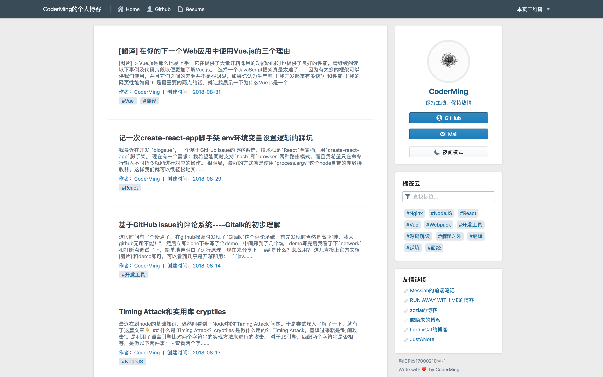

# Blogsue —— 基于 Github Issues 的博客系统

本项目是基于GitHub Issues的博客系统，技术栈为React全家桶。

很早以前，就有各路大佬开始使用Github Issues做自己的博客了。但其博客有诸多不足之处。例如不能禁止他人发issue，不能自定义样式，不能搭建在自己的域名下等等。

项目的目的是为了弥补GitHub Issues的问题，具有以下功能：

- 傻瓜式操作，只需填写一份配置文件即可使用
- 支持GitHub Pages（需采用hash路由模式
- **已集成[Gitalk](https://github.com/gitalk/gitalk)评论系统**，文章的评论即为对应issue的comment
- **支持夜间模式**
- 可筛选显示在博客上面的issue作者，防止他人发issue污染博客
- 移动端适配，同时支持PWA
- Labels做为博客标签云，支持通过label快速筛选文章
- 支持Docker一键打包/部署

## 界面展示

预览：[CoderMing的个人博客](https://www.coderming.com)

PC端：

手机端：

## 使用教程

**[请点击这里](./how-to-use.md)**

## 使用本项目的博客

如果你的博客使用了本项目，可以发issue并附上链接，我会尽快更新至本列表。

- [CoderMing的个人博客](https://www.coderming.com)

## 参与本项目

欢迎大家发issue，提PR。

受阅历限制，本项目定有诸多不完善的地方。如果您觉得项目中有可以优化的地方，请提出来，我会进行修改与完善。

## 联系

[@CoderMing](https://www.coderming.com)