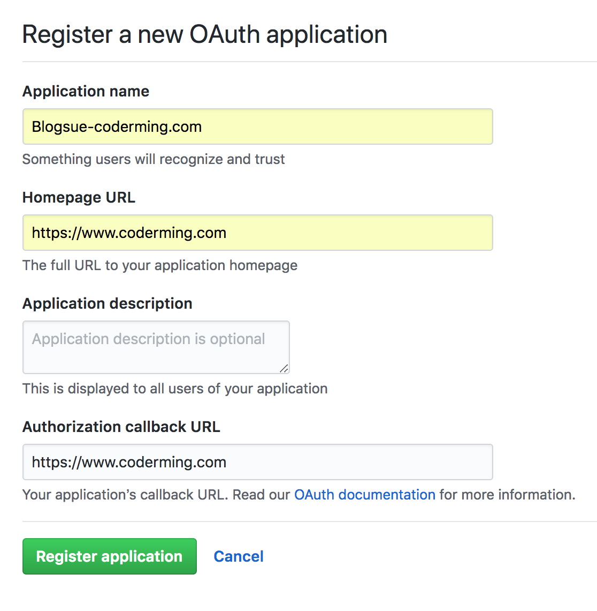
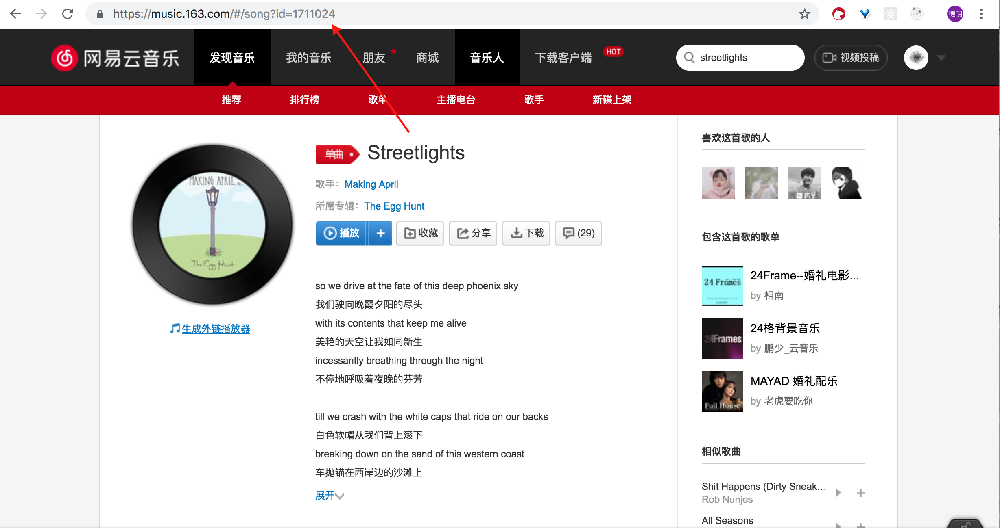

# Blogsue 使用教程

## 前期准备

首先你需要 `NodeJS 6+`。

如果你希望你的博客引入评论系统，你需要一个 GitHub OAuth App 的 key。

如果不需要的话，可以直接跳过这一部分。

打开[这里](https://github.com/settings/developers)（Github 主页 -> Settings -> Developer settings），点击右上角“New OAuth App“，填写 Application name 为自定义 APP 名，HomePage URL 和 callback URL 均为你搭建博客所在的域名：

然后你会获得一个 AppKey 和 AppSecret。

## 博客配置

首先 clone 本仓库：

```
$ git clone https://github.com/CoderMing/blogsue.git
```

然后进入`src/config/`目录，新建一个`index.js`文件。

此文件就是 Blogsue 的配置文件。本项目提供了一个示例文件`index-example.js`。里面包含很多配置项，都有详细的注释声明。

你应该将上述申请到的 AppKey 和 AppSecret 填入此文件的 clientID 和 clientSecret 字段。

### 网易云音乐 ID 怎么找



## 打包

#### 一般情况

首先安装依赖 `cnpm install`。

一般情况下，运行以下命令即可打包出 build 后的文件：

```
$ npm run build
```

**Tips: GitHub Pages 下运行需要使用 hash 路由打包。** 本项目提供了对应的打包方法：

```
$ npm run build:hash
```

打包完成后文件放在`build/`文件夹中。

#### 使用 Docker

本项目采用`node:slim`底包。容器暴露端口默认为 8080。

## 遇到问题？

你可以来本项目发 Issue。
