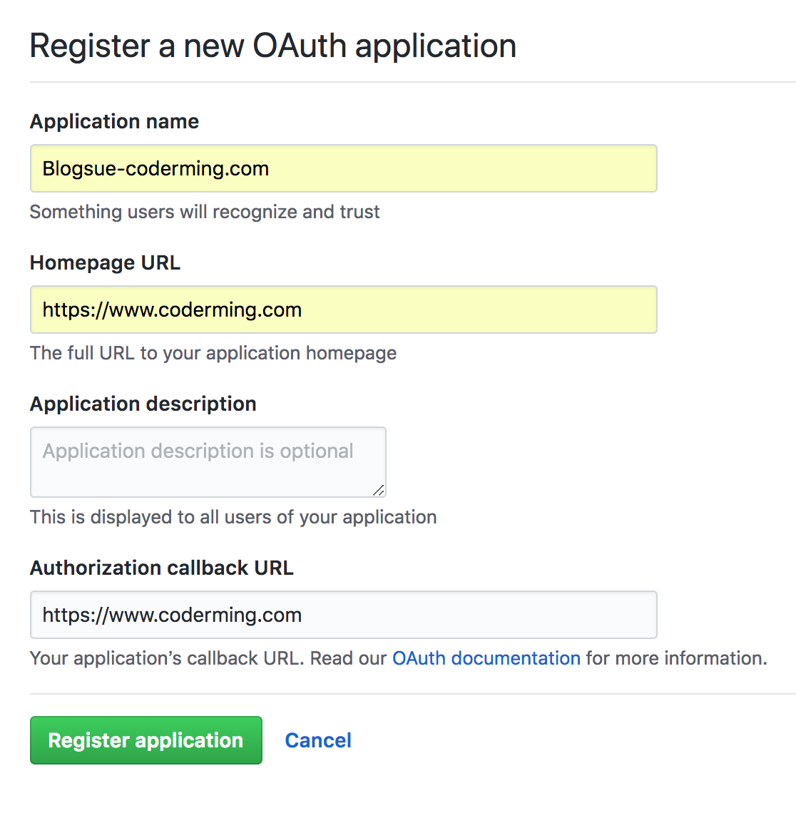

# Blogsue使用教程

## 前期准备

首先你需要一个GitHub OAuth App的key。

打开[这里](https://github.com/settings/developers)（Github主页 -> Settings -> Developer settings），点击右上角“New OAuth App“，填写Application name为自定义APP名，HomePage URL和 callback URL均为你搭建博客所在的域名：

然后你会获得一个AppKey和 AppSecret。


## 博客配置

首先clone本仓库：

```
$ git clone https://github.com/CoderMing/blogsue.git
```

然后进入`src/config/`目录，新建一个`index.js`文件。

此文件就是Blogsue的配置文件。本项目提供了一个示例文件`index-example.js`。里面包含很多配置项，都有详细的注释声明。

你应该将上述申请到的 AppKey 和 AppSecret 填入此文件的 clientID 和 clientSecret 字段。


## 打包

#### 一般情况

首先安装依赖 `cnpm install`。

一般情况下，运行以下命令即可打包出build后的文件：

```
$ npm run build
```

**Tips: GitHub Pages下运行需要使用hash路由打包。** 本项目提供了对应的打包方法：

```
$ npm run build:hash
```

打包完成后文件放在`build/`文件夹中。


#### 使用Docker

本项目采用`node:slim`底包。容器暴露端口默认为8080。


## 遇到问题？

你可以来本项目发Issue。